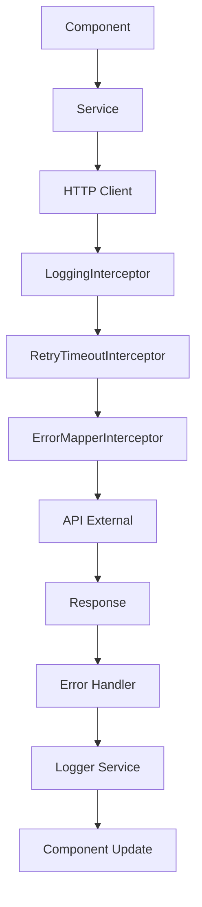

# Arquitectura del Proyecto de Ejemplo de Angular 20

## 📐 Visión General

Este proyecto de ejemplo sigue una arquitectura modular y escalable basada en las mejores prácticas de Angular y desarrollo frontend profesional.

## 🏗️ Principios de Arquitectura

### 1. Separación de Responsabilidades

La separación de responsabilidades es un principio fundamental que divide el código en módulos específicos, cada uno con una función claramente definida. Este enfoque reduce la complejidad del sistema y facilita el mantenimiento.

- **Core**: Servicios centrales, interceptors, utilities
  - _Definición_: El módulo Core contiene la lógica fundamental que debe estar disponible en toda la aplicación. Incluye servicios singleton como el LoggerService, interceptors HTTP que procesan todas las peticiones, y utilidades compartidas que no pertenecen a ninguna característica específica.
- **Features**: Módulos de funcionalidades específicas
  - _Definición_: Cada feature representa una funcionalidad completa e independiente de la aplicación. Son módulos autocontenidos que pueden cargarse de forma lazy, tienen sus propios componentes, servicios y rutas. Esta modularidad permite el desarrollo paralelo por equipos y facilita la escalabilidad.
- **Shared**: Componentes, pipes, directivas reutilizables
  - _Definición_: El módulo Shared agrupa elementos de UI y lógica que se utilizan en múltiples features. Esto evita la duplicación de código y garantiza consistencia visual y funcional en toda la aplicación.
- **Layout**: Componentes de estructura y navegación
  - _Definición_: Layout define la estructura visual base de la aplicación, incluyendo headers, sidebars, footers y navigation. Proporciona un marco consistente sobre el cual se renderizan las diferentes features.

### 2. Dependency Injection

Angular utiliza un sistema de inyección de dependencias robusto que promueve el bajo acoplamiento y alta testabilidad. Este patrón permite que los objetos reciban sus dependencias desde un contenedor externo en lugar de crearlas directamente.

- **Servicios singleton en el root injector**
  - _Definición_: Los servicios registrados en el root injector se crean una sola vez durante el ciclo de vida de la aplicación y se comparten entre todos los componentes. Esto es ideal para servicios que mantienen estado global como el LoggerService o servicios de configuración.
- **Providers específicos por feature cuando sea necesario**
  - _Definición_: Algunos servicios pueden necesitar instancias separadas por feature para mantener estado aislado o configuraciones específicas. Angular permite registrar providers a nivel de módulo o componente para estos casos.
- **Inyección de dependencias a través de `inject()` function**
  - _Definición_: La función `inject()` es la forma moderna de inyectar dependencias en Angular, reemplazando la inyección por constructor. Permite inyección condicional, mejor tree-shaking y mayor flexibilidad en la composición de servicios.

### 3. Standalone Components

Los Standalone Components representan un cambio paradigmático en Angular, eliminando la necesidad de NgModules para la mayoría de casos de uso y simplificando la estructura de la aplicación.

- **Componentes independientes sin NgModules**
  - _Definición_: Los componentes standalone declaran sus dependencias directamente a través de la propiedad `imports`, eliminando la complejidad de los módulos intermedios. Esto hace que el código sea más explícito y fácil de entender.
- **Importaciones explícitas y tree-shaking optimizado**
  - _Definición_: Al declarar importaciones directamente en los componentes, el bundler puede determinar exactamente qué código se utiliza, eliminando automáticamente el código no utilizado (tree-shaking). Esto resulta en bundles más pequeños y mejor rendimiento.
- **Configuración declarativa en `app.config.ts`**
  - _Definición_: La configuración de la aplicación se centraliza en un archivo de configuración que utiliza providers funcionales. Esto reemplaza el AppModule tradicional con una aproximación más funcional y componible.

## 📁 Estructura Detallada

```
src/app/
├── core/                           # 🔧 Servicios centrales
│   ├── interceptors/              # HTTP Interceptors
│   │   ├── error-mapper.interceptor.ts
│   │   ├── logging.interceptor.ts
│   │   └── retry-timeout.interceptor.ts
│   ├── services/                  # Servicios core
│   │   └── logger.service.ts
│   ├── models/                    # Interfaces y tipos
│   ├── guards/                    # Route Guards
│   └── utils/                     # Utilidades compartidas
│
├── features/                      # 🎯 Funcionalidades
│   └── home/                     # Feature ejemplo
│       ├── home.component.ts
│       ├── home.component.html
│       └── home.component.scss
│
├── layout/                        # 🖼️ Componentes de layout
│   └── header/                   # Componente header
│
├── shared/                        # 🔄 Componentes compartidos
│   ├── components/               # Componentes reutilizables
│   │   └── not-found/
│   ├── directives/               # Directivas personalizadas
│   ├── pipes/                    # Pipes personalizados
│   └── utils/                    # Utilidades compartidas
│
├── app.config.ts                 # ⚙️ Configuración principal
├── app.routes.ts                 # 🛣️ Definición de rutas
├── app.html                      # Template principal
├── app.scss                      # Estilos del componente raíz
└── app.ts                        # Componente raíz
```

## 🔌 HTTP Interceptors

Los HTTP Interceptors son un patrón de middleware que permite procesar peticiones HTTP de forma centralizada. Actúan como una cadena de responsabilidad que intercepta todas las peticiones HTTP salientes y las respuestas entrantes, permitiendo implementar funcionalidades transversales como logging, autenticación, manejo de errores y reintentos.

### LoggingInterceptor

El LoggingInterceptor implementa un sistema de monitoreo comprehensivo para todas las comunicaciones HTTP de la aplicación. Su propósito principal es proporcionar visibilidad completa del tráfico de red para facilitar el debugging y el monitoreo en producción.

```typescript
@Injectable()
export class LoggingInterceptor implements HttpInterceptor {
  // Logs detallados de requests/responses
  // Timing de peticiones
  // Separación dev/prod
}
```

**Responsabilidades:**

- **Logging automático de todas las peticiones HTTP**
  - _Definición_: Captura automáticamente todos los requests salientes incluyendo método HTTP, URL, headers y body. Esta información es crucial para debugging y auditoría de la aplicación.
- **Métricas de performance (timing)**
  - _Definición_: Mide el tiempo de respuesta de cada petición desde el envío hasta la recepción completa. Estas métricas permiten identificar cuellos de botella y optimizar la performance de la aplicación.
- **Debugging información en desarrollo**
  - _Definición_: En modo desarrollo, proporciona información detallada y formateada en la consola del navegador, facilitando la identificación y resolución de problemas durante el desarrollo.

### RetryTimeoutInterceptor

El RetryTimeoutInterceptor implementa estrategias de resiliencia para manejar fallos temporales de red y mejorar la robustez de la aplicación ante condiciones adversas de conectividad.

```typescript
@Injectable()
export class RetryTimeoutInterceptor implements HttpInterceptor {
  // Reintentos automáticos
  // Timeouts configurables
  // Backoff exponencial
}
```

**Responsabilidades:**

- **Manejo de timeouts por endpoint**
  - _Definición_: Configura timeouts específicos para diferentes endpoints basándose en la naturaleza de la operación. Operaciones críticas pueden tener timeouts más largos, mientras que operaciones de UI pueden tener timeouts más cortos para mejor experiencia de usuario.
- **Estrategia de reintentos inteligente**
  - _Definición_: Implementa lógica que determina cuándo es apropiado reintentar una petición fallida. Solo reintenta en errores temporales (5xx, timeouts) y evita reintentos en errores del cliente (4xx) para prevenir loops infinitos.
- **Resiliencia ante fallos temporales**
  - _Definición_: Utiliza backoff exponencial para espaciar los reintentos, reduciendo la carga en servicios bajo estrés y aumentando las probabilidades de éxito en intentos posteriores.

### ErrorMapperInterceptor

El ErrorMapperInterceptor centraliza el manejo de errores HTTP, transformándolos en errores de aplicación consistentes y proporcionando mensajes apropiados para diferentes audiencias.

```typescript
@Injectable()
export class ErrorMapperInterceptor implements HttpInterceptor {
  // Mapeo de errores HTTP
  // Mensajes user-friendly
  // Logging centralizado
}
```

**Responsabilidades:**

- **Transformación de errores HTTP a errores de aplicación**
  - _Definición_: Convierte errores HTTP genéricos en objetos de error estructurados que contienen códigos de error específicos de la aplicación, mensajes traducibles y contexto relevante para el debugging.
- **Mensajes consistentes para usuarios**
  - _Definición_: Proporciona mensajes de error amigables y traducibles que ocultan detalles técnicos del usuario final pero proporcionan información suficiente para entender qué ocurrió y cómo proceder.
- **Logging estructurado de errores**
  - _Definición_: Registra errores de forma estructurada con metadatos como timestamp, URL, método HTTP y contexto del usuario, facilitando el análisis posterior y la resolución de problemas.

## 🔄 Flujo de Datos



## 🛡️ Manejo de Errores

El manejo de errores en aplicaciones Angular requiere una estrategia multicapa que capture y procese errores en diferentes niveles de la aplicación, desde errores de red hasta errores de lógica de negocio y errores inesperados de runtime.

### 1. Niveles de Error

La arquitectura de manejo de errores se estructura en múltiples capas, cada una con responsabilidades específicas y mecanismos de escalación apropiados.

- **Network Level**: Interceptors
  - _Definición_: Los interceptors HTTP capturan errores de comunicación con servicios externos, incluyendo timeouts, errores de conectividad y respuestas HTTP con códigos de error. Este nivel se encarga de implementar estrategias de reintento y transformación inicial de errores de red.

- **Service Level**: Servicios específicos
  - _Definición_: Los servicios de dominio manejan errores específicos de la lógica de negocio, validando datos de entrada, transformando errores de API en errores de dominio y aplicando reglas de negocio para determinar cómo procesar diferentes tipos de fallos.

- **Component Level**: UI error handling
  - _Definición_: Los componentes manejan la presentación de errores al usuario, incluyendo la visualización de mensajes de error, el manejo de estados de carga fallidos y la implementación de mecanismos de recuperación a nivel de UI.

- **Global Level**: Error boundary pattern
  - _Definición_: Un manejador global de errores captura errores no manejados en otros niveles, implementa logging de emergencia y proporciona mecanismos de recuperación de último recurso para mantener la aplicación en un estado funcional.

### 2. Error Types

Los errores se tipifican usando una interfaz estructurada que proporciona información consistente y procesable para diferentes consumidores del sistema de errores.

```typescript
interface AppError {
  code: string; // Código identificador
  message: string; // Mensaje user-friendly
  details?: unknown; // Información técnica
  timestamp: Date; // Timestamp del error
  url?: string; // URL donde ocurrió
  method?: string; // Método HTTP
}
```

**Componentes del Error Type:**

- **Code**: Identificador único que permite categorización y manejo programático de errores
- **Message**: Mensaje legible para humanos que puede mostrarse directamente al usuario
- **Details**: Información técnica adicional útil para debugging pero no apropiada para usuarios finales
- **Timestamp**: Marca de tiempo que facilita la correlación de errores con logs del servidor
- **URL/Method**: Contexto de la petición que facilita la reproducción y debugging del error

## 📊 Logging Strategy

### 1. Logger Service

```typescript
@Injectable({
  providedIn: 'root',
})
export class LoggerService {
  info(message: string, data?: unknown): void;
  warn(message: string, data?: unknown): void;
  error(message: string, error?: unknown): void;
  debug(message: string, data?: unknown): void;
  http(method: string, url: string, data?: unknown): void;
}
```

### 2. Log Levels

- **DEBUG**: Información detallada para desarrollo
- **INFO**: Información general de la aplicación
- **WARN**: Situaciones que requieren atención
- **ERROR**: Errores que necesitan investigación

## 🎨 Estilos y Theming

### 1. Arquitectura SCSS

```scss
src/styles/
├── _variables.scss     # Variables globales
├── _mixins.scss       # Mixins reutilizables
├── _globals.scss      # Estilos globales
├── _minimal.scss      # Reset/normalize
└── _index.scss        # Punto de entrada
```

### 2. Component Styles

- **Encapsulation**: ViewEncapsulation.Emulated (default)
- **SCSS**: Preprocesador configurado
- **BEM**: Metodología recomendada para naming

## 🔒 Configuración de Seguridad

### 1. TypeScript Strict Mode

```json
{
  "strict": true,
  "noImplicitOverride": true,
  "noPropertyAccessFromIndexSignature": true,
  "noImplicitReturns": true,
  "noFallthroughCasesInSwitch": true
}
```

### 2. ESLint Security Rules

- No uso de `eval()`
- Validación de templates
- Rules para prevenir XSS
- Complexity limits

## 🚀 Performance Optimizations

### 1. Build Optimizations

- **Tree Shaking**: Standalone components
- **Code Splitting**: Lazy loading routes
- **Bundle Analysis**: Angular CLI built-in
- **Compression**: Production builds

### 2. Runtime Optimizations

- **OnPush Change Detection**: Recomendado
- **TrackBy Functions**: Para \*ngFor
- **Async Pipe**: Para subscriptions
- **Lazy Loading**: Para features

## 🔧 Development Tools

### 1. Code Quality

- **ESLint**: Linting rules
- **Prettier**: Code formatting
- **Husky**: Git hooks
- **Commitizen**: Conventional commits

### 2. Testing

- **Karma + Jasmine**: Unit testing
- **Code Coverage**: Istanbul reports
- **CI Scripts**: Automated testing

## 📈 Escalabilidad

### 1. Horizontal Scaling

- **Feature Modules**: Separación clara
- **Lazy Loading**: Carga bajo demanda
- **Explicit Imports**: Importaciones directas y claras
- **Service Isolation**: Responsabilidades claras

### 2. Team Scaling

- **Code Standards**: ESLint + Prettier
- **Documentation**: Inline + external docs
- **Testing Strategy**: Unit + integration
- **Review Process**: Pull request templates

## 🔄 CI/CD Integration

### 1. Scripts NPM

```json
{
  "test:ci": "ng test --watch=false --browsers=ChromeHeadless --code-coverage",
  "lint": "ng lint",
  "format:check": "prettier --check \"src/**/*.{ts,html,scss,css,json}\"",
  "code-quality": "npm run lint && npm run format:check"
}
```

### 2. Pipeline Steps

1. **Install dependencies**
2. **Code quality checks**
3. **Unit tests with coverage**
4. **Build application**
5. **Deploy to staging/production**

## 📋 Mejores Prácticas

### 1. Component Design

- **Single Responsibility**: Un propósito por componente
- **Input/Output**: Comunicación clara entre componentes
- **OnPush**: Change detection strategy
- **Unsubscribe**: Memory leak prevention

### 2. Service Design

- **Injectable**: Proper dependency injection
- **Error Handling**: Consistent error management
- **Type Safety**: Strong typing
- **Testing**: Unit testable services

### 3. State Management

- **Local State**: Component state
- **Shared State**: Services
- **Complex State**: NgRx (cuando sea necesario)
- **Reactive Patterns**: RxJS operators

---

Esta arquitectura proporciona una base sólida y escalable para proyectos Angular profesionales, con enfoque en mantenibilidad, testabilidad y performance. Este proyecto de ejemplo demuestra la implementación práctica de todos estos conceptos.
